# مقدمه

در این آزمایش یک پروژه‌ی نمونه را با کمک ابزار کنترل نسخه‌ی git
ایجاد می‌کنیم. پروژه‌ی نمونه‌ی انتخاب شده پروژه‌ی درس شبیه‌سازی کامپیوتری است.

# مراحل ایجاد نرم‌افزار

## اضافه کردن فایل‌های اصلی

در ابتدا در برنچ اصلی فایل‌های اصلی برنامه را اضافه کردیم. این فایل‌ها شامل README, requirements, و فایل Main هستند. سپس فایل .gitignore را برای نادیده گرفتن فایل‌های اضافه در نظر گرفتیم. برای ساخت این فایل از نمونه‌ی این فایل برای زبان Python کمک گرفتیم. می‌توانید مراحل اضافه کردن این فایل‌ها به گیت و push‌ کردنشان به ریپوی remote را در تصاویر زیر نظاره کنید.

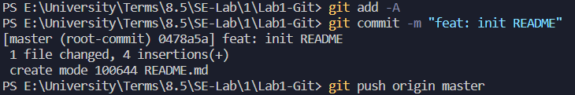
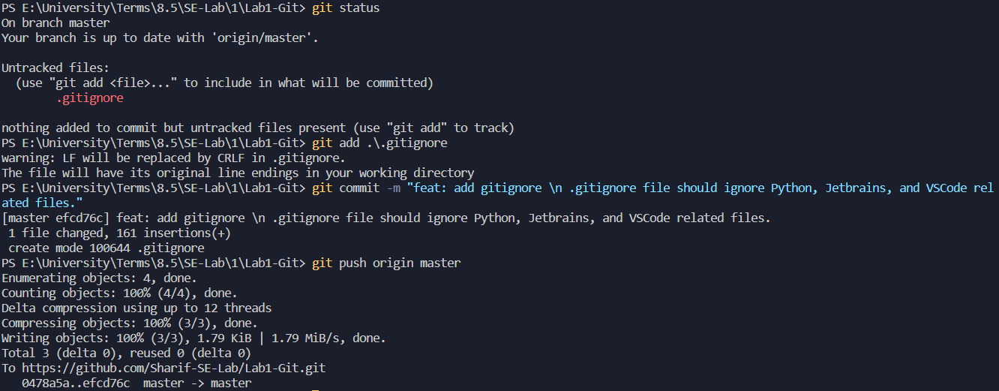
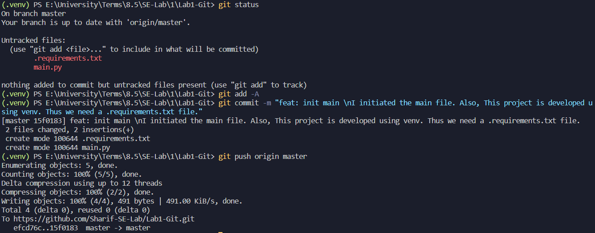
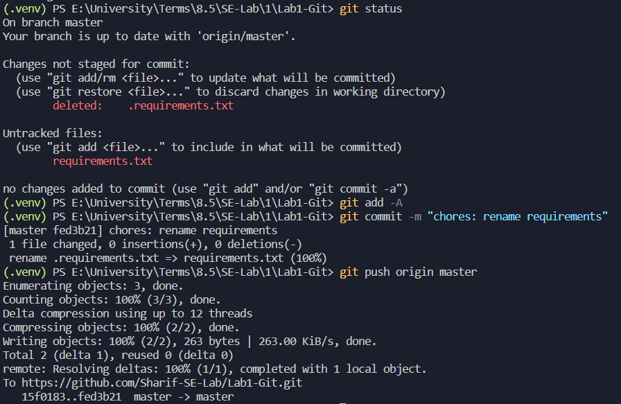
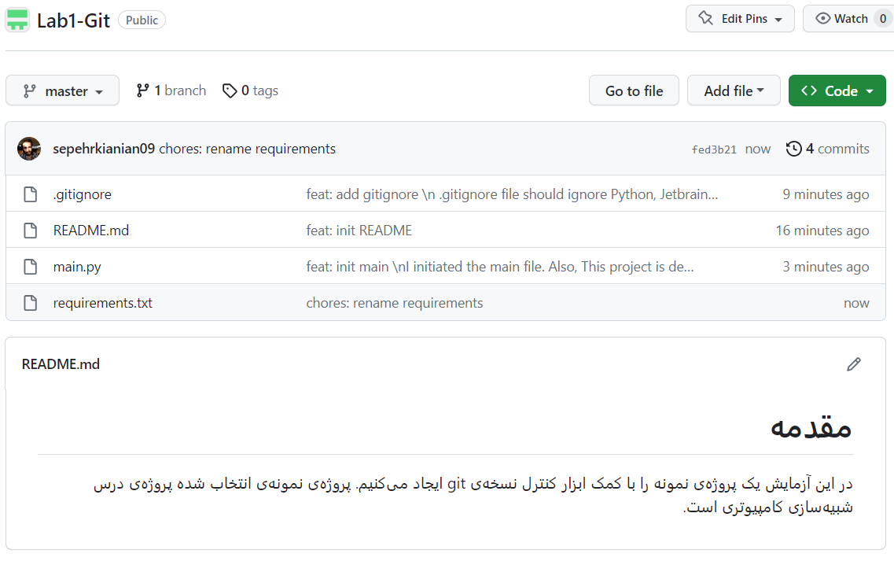

در آخر نظاره می‌کنید که این فایل‌ها به مخزن اضافه شدند.

## تقسیم کار و ساخت برنچ‌ها

پس از ایجاد فایل‌های اصلی، پروژه را به قسمت‌هایی بین خودمان تقسیم کردیم. سپس برای پیش‌بردن کارها به صورت موازی و ایمن، سه شاخه‌ی اضافه برای پروژه ساختیم: devs که تغییرات ادغام شده‌ی ما در آن است، و dev/sepehr, dev/ashkan برای هرکدام از ایجادکنندگان. می‌توانید در تصاویر زیر مراحل ساخت شاخه‌ها و فرستادنشان به مخزن remote را نظاره کنید.

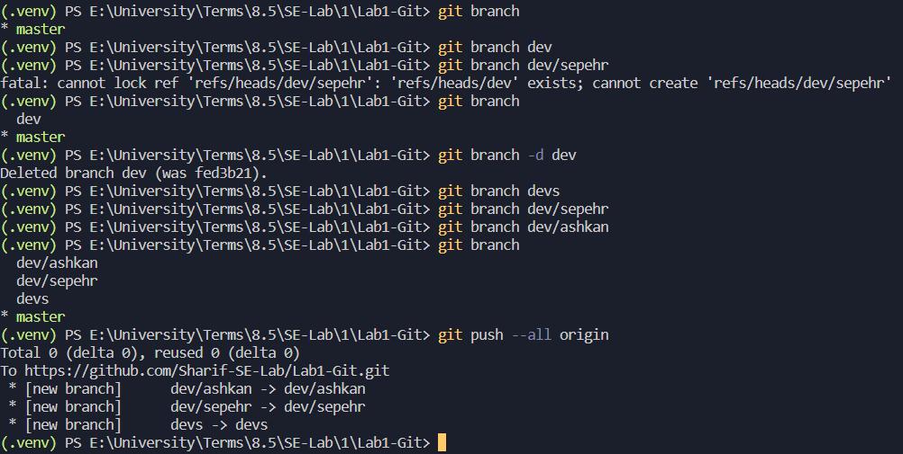
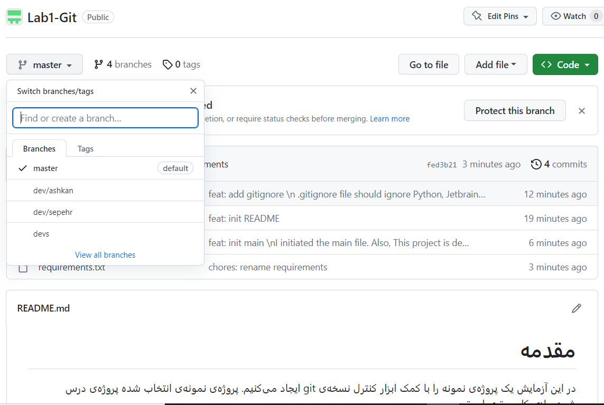
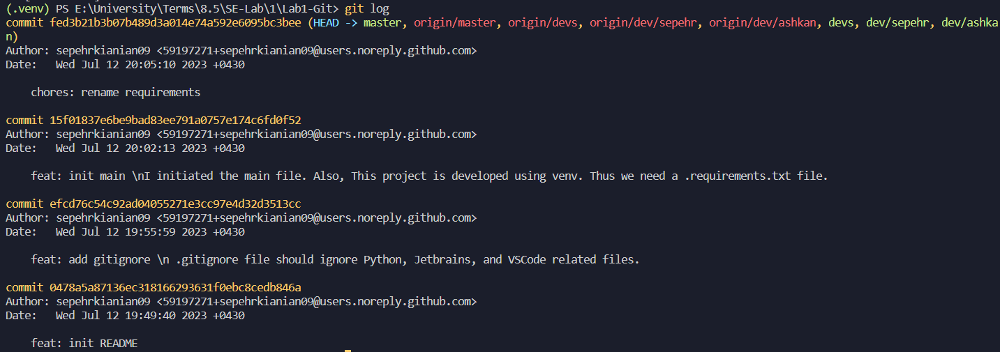

سپس نیاز بود که شاخه‌ی اصلی را `protected` کنیم تا در آن به طور مستقیم تغییری اضافه نشود، و فقط با ساخت pull request این کار انجام شود. می‌توانید جزئیات و مواردی که این protection دارد را در شکل زیر مشاهده کنید.
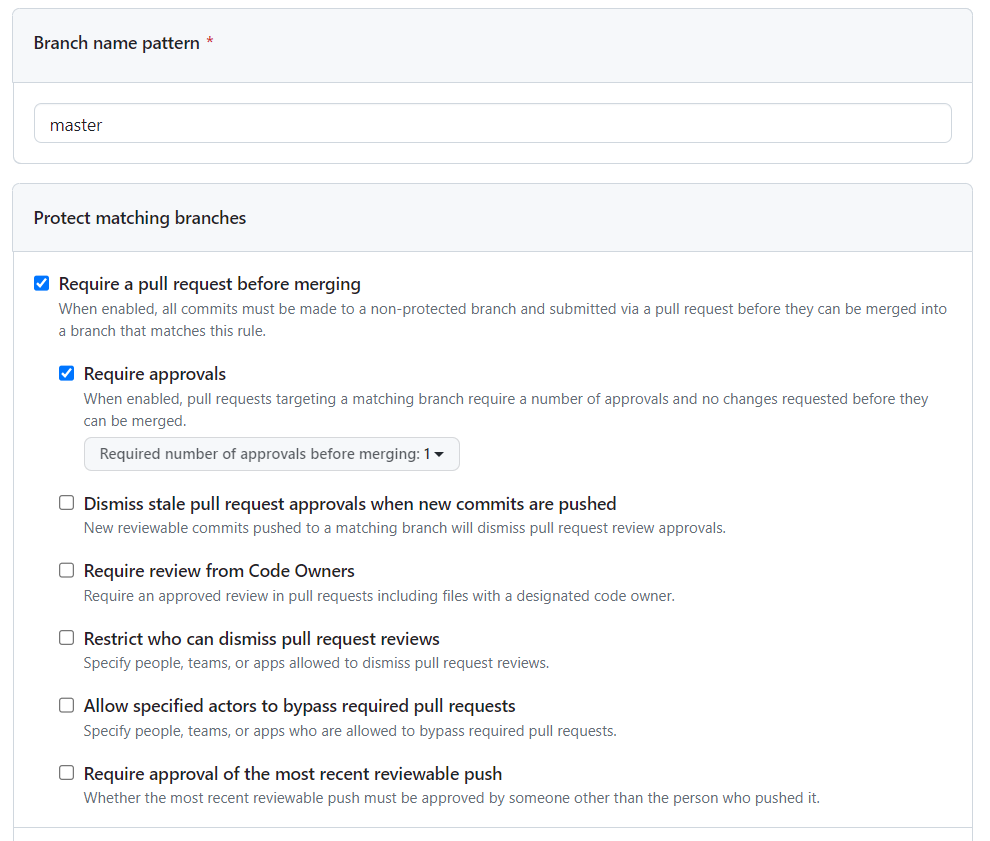

## ایجاد قسمت‌های مختلف و ادغام آن‌ها

حال ایجاد پروژه را آغاز می‌کنیم. برای این کار، ابتدا هر شخص وارد شاخه‌ی مختص ایجاد خودش می‌شود. در شکل زیر مشاهده می‌کنید سپهر وارد شاخه‌ی خودش می‌شود.
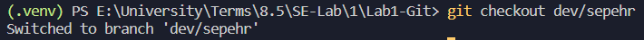

اشکان در حین کار نیاز بود فایل generator.py را در اوایل کار commit نکند، اما اشتباهی آن را به گیت اضافه کرده بود. در نتیجه، با استفاده از دستور `git reset` فایل را از گیت بیرون آورد. طریقه‌ی انجام این کار را در تصویر زیر مشاهده می‌کنید.
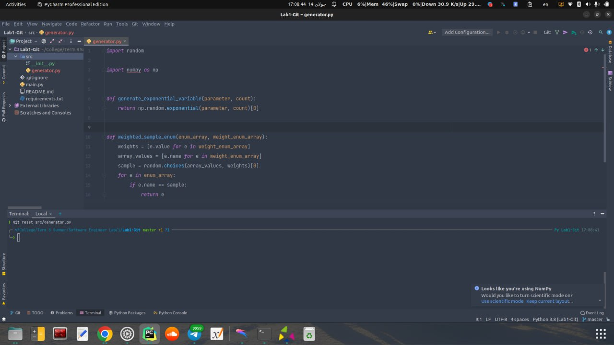

در حین ایجاد قسمت‌های مختلف و ادغام آن‌ها، به یک سری مغایرت‌هایی برخورد کردیم، که در ادامه آن‌ها را بررسی و چگونگی برطرف کردن آن‌ها را نشان می‌دهیم. لازم به ذکر است، برای انجام عمل ادغام، به طور مستقیم از دستور `merge` استفاده نکردیم. صرفا در یک شاخه وارد شدیم و شاخه‌ی دیگر را pull کردیم. این عمل به صورت خودکار شاخه‌ی دیگر را با شاخه‌ی اصلی‌مان merge می‌کند.

### ادغام ۱

در اولین ادغام یک‌سری فایل‌هایی بودند که هر دو فرد در شاخه‌ی خود ایجاد کرده بودند و به مغایرت خوردند. یک فرد آن‌هارا کامل ایجاد کرده بود، اما دیگری صرفا آن‌هارا تعریف کرده بود و درونش خالی بود. برای رفع مغایرت این فایل‌ها، در همه‌ی قسمت‌ها، آن‌هایی که فرد کامل ایجاد کرده بود را پذیرفتیم و تغییرات فرد دیگر را کامل نادیده گرفتیم. برای انتخاب این قسمت‌ها، اندکی از نرم‌افزار `VSCode` استفاده کردیم. در تصاویر زیر چگونگی برطرف ساختن این مغایرت را مشاهده می‌کنید.
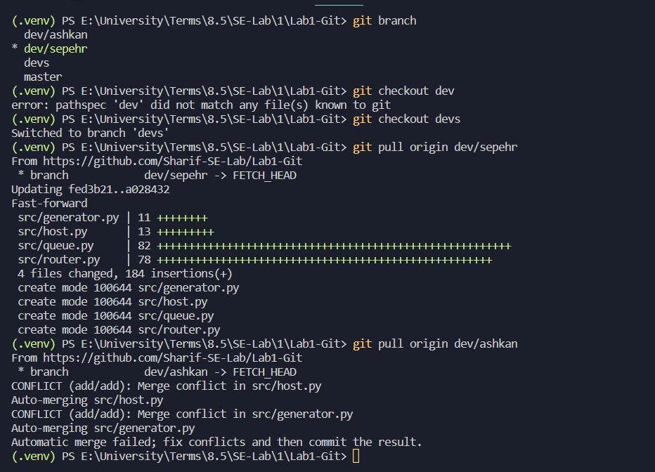
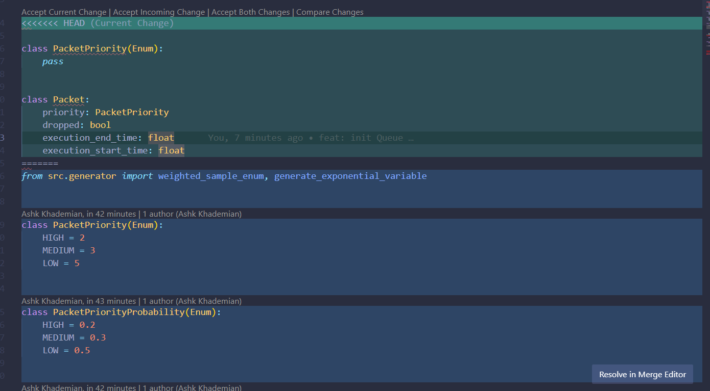
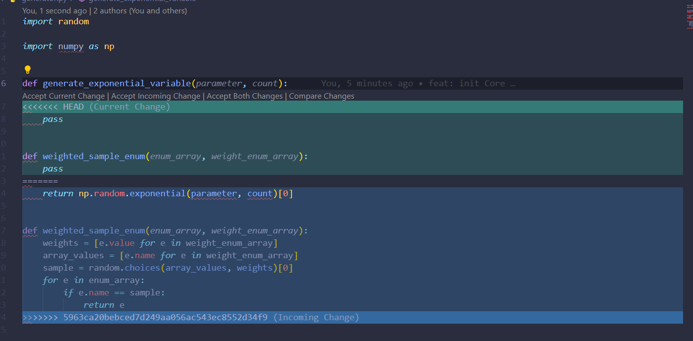
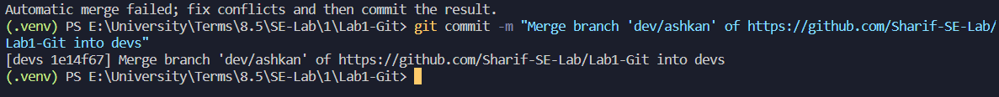

### ادغام ۲

در دومین ادغام، متاسفانه در یک فایل تغییرات دو نفر باهم مغایرت داشت. این مغایرت به خاطر ایجاد قسمت‌هایی نبود، بلکه آن فایل از قبل به طور کامل ایجاد شده بود. صرفا برای رفع خطا کردن قسمت‌های مختلف، یک‌سری log در قسمت‌های مختلف آن فایل گذاشته شده بود، که این قسمت‌ها در بعضی جاها یکسان بودند. برای رفع این مغایرت، از آنجا که خطاها رفع شده بود و دیگر نیازی به این logها نداشتیم، همه‌ی این log‌ها را در آن فایل پاک کردیم. در این ادغام، از ویژگی دیگر نرم‌افزار `VSCode` برای رفع مغایرت استفاده کردیم. در تصاویر زیر چگونگی برطرف ساختن این مغایرت را مشاهده می‌کنید.
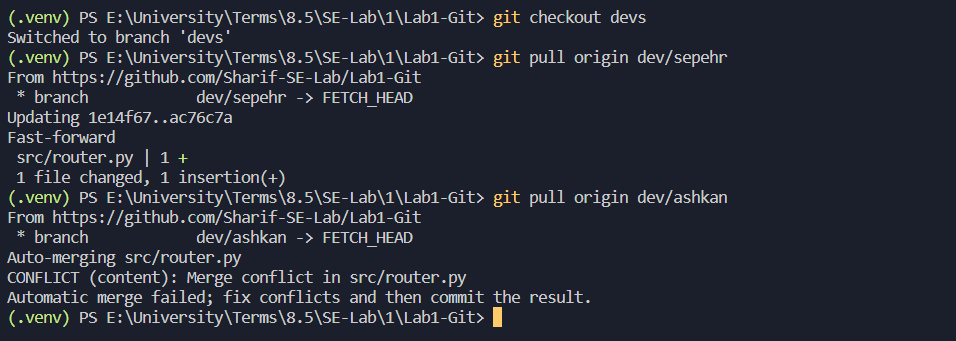
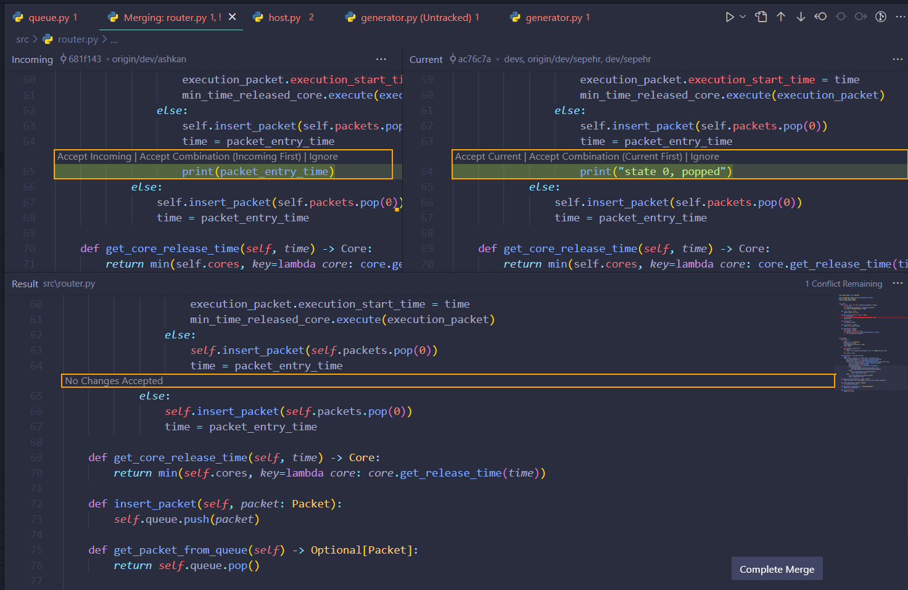
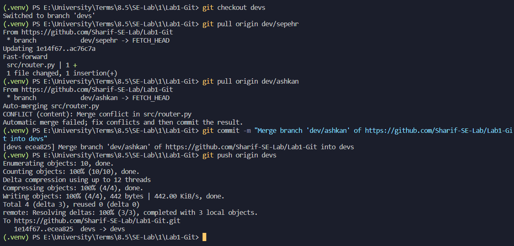

### ادغام ۳

در ادغام آخر، از آنجا که فقط سپهر یک قسمت‌هایی را ایجاد کرده بود، مغایرتی ایجاد نشد و ادغام خیلی ساده انجام پذیرفت. در تصویر زیر انجام ادغام را مشاهده می‌کنید.
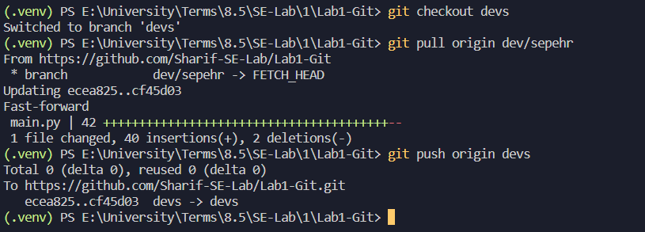

## اتمام ایجاد و فرستادن تغییرات به برنچ اصلی

حال که ایجاد پروژه به اتمام رسید، نیاز شد تغییرات شاخه‌ی devs را وارد شاخه‌ی اصلی، یعنی master کنیم. از آنجا که شاخه‌ی اصلی محافظت‌شده است، نمی‌توانستیم این کار را به صورت مستقیم انجام دهیم. نیاز شد یک pull request برای این کار بسازیم. مراحل انجام این کار را می‌توانید در تصاویر زیر مشاهده کنید.
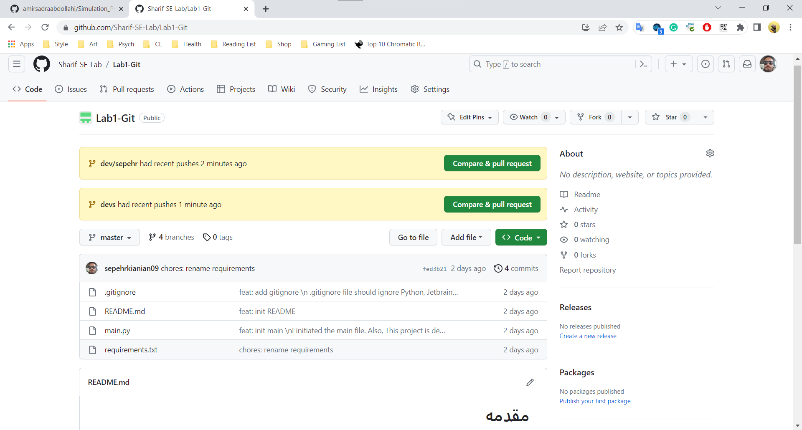
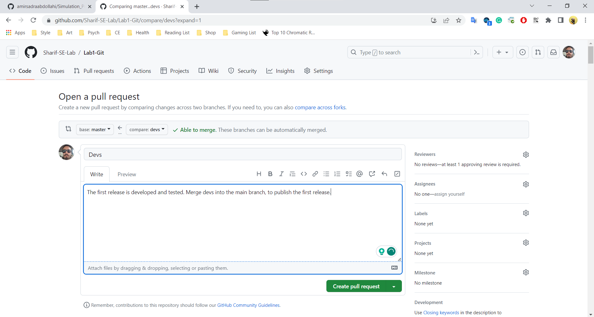
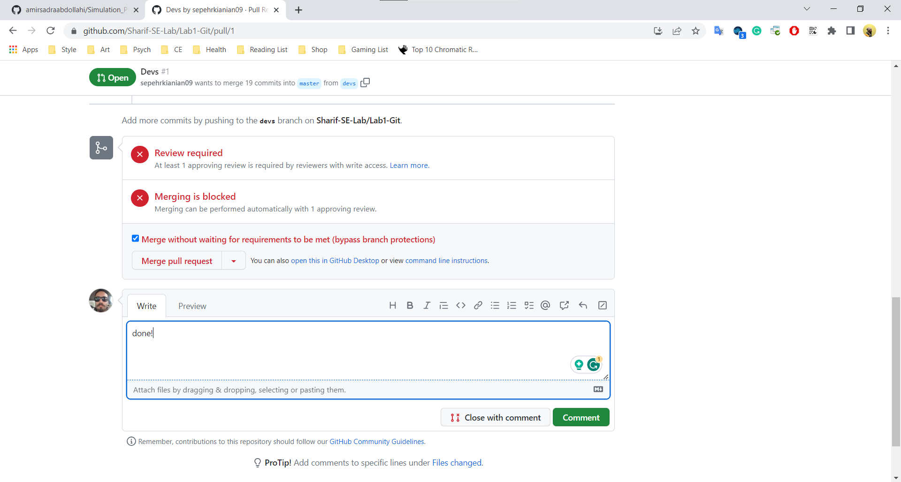
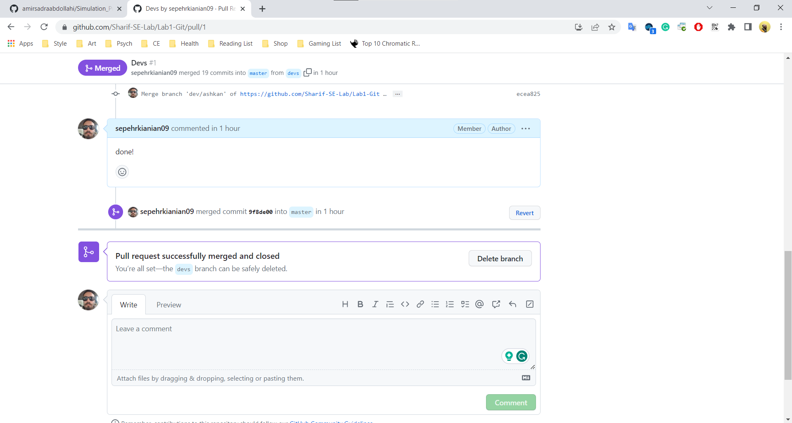
